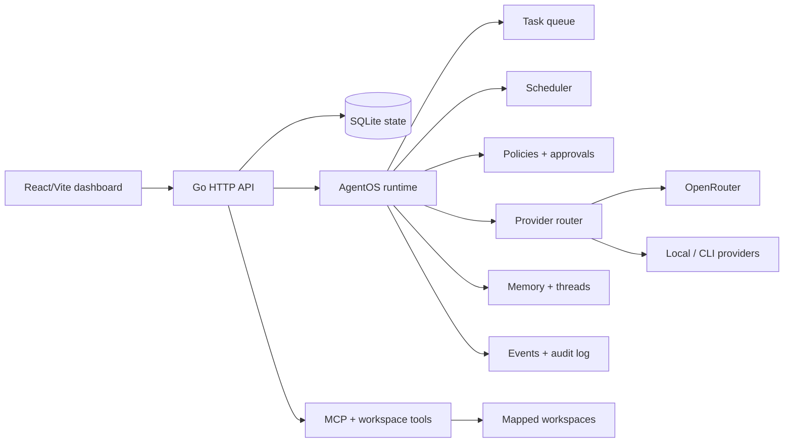
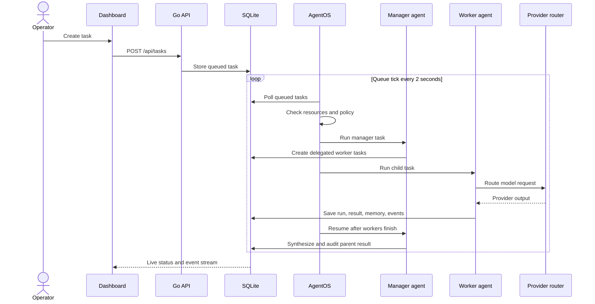

# AgentHQ (Apollo)


AgentHQ is a Career OS for autonomous AI work: a system where companies, departments, agents, tools, policies, memory, and execution live in one operating model.

The repository is named **Apollo** because that is the original project codename. **AgentHQ** is the product name. Read “AgentHQ (Apollo)” as one system: Apollo is the codebase; AgentHQ is the operating layer built on it.

## What AgentHQ does

AgentHQ turns a blank workspace into an AI organization:

- **Company → department → agent.** Create companies with departments, workspace roots, deployment commands, and timezone-aware operations.
- **Managers and workers.** Give agents explicit roles and reporting lines. Manager agents can delegate work to eligible worker agents, wait for child tasks, and synthesize their results.
- **AgentOS execution.** A background runtime polls the task queue every two seconds, admits work based on policy and host pressure, runs tasks concurrently within limits, and emits live events.
- **Governance as a runtime boundary.** Policies apply to actions such as task execution, delegation, memory writes, scheduling, hierarchy changes, model binding, and thread writes. Disallowed or approval-gated work blocks instead of silently proceeding.
- **Provider routing.** Bind models to agents through provider profiles and fallback chains. The runtime supports OpenRouter, local execution, and CLI-backed Codex, Claude, and Gemini providers.
- **Tools and workspaces.** Connect MCP servers over stdio or HTTP, inspect mapped workspace trees, edit files, run commands, and trigger deployment commands from the same control plane.
- **Schedules and autonomous follow-through.** Run recurring or one-time tasks. Agents can emit structured schedule and inter-agent message blocks that become durable operations.
- **Memory and continuity.** Store scoped memory entries, retrieve context for future runs, keep thread history, and preserve task results instead of treating every run as a disposable chat.
- **Subagents and observability.** Track runs, queue state, resource pressure, events, approvals, health, topology, and tamper-evident audit history.

The core idea is simple: AI is modeled as an operating organization, not as a collection of disconnected chat windows.

## Architecture

The React/Vite dashboard is the operator surface. The Go backend owns the API, SQLite state, AgentOS runtime, provider routing, policy enforcement, tools, scheduling, memory, and audit trail.



## One agent execution flow

An ordinary task can move through the whole system:

1. An operator creates a task for an agent from the dashboard.
2. The API stores the task with its company, department, agent, thread, priority, and parent-task context.
3. AgentOS polls the queue, checks the kill switch, CPU/RAM pressure, worker limits, and policy decision, then admits or blocks the task.
4. If the target is a manager, it selects eligible workers in the same department, creates delegated child tasks, and puts the manager task into a waiting state.
5. Worker tasks build prompts from identity, thread, and scoped memory, then call the selected provider and its fallback chain.
6. Results update task and run records, append thread messages, write durable memory, emit events, and append audit entries. Structured output can also create a schedule or send a message to another agent.
7. When children finish, AgentOS resumes the manager, synthesizes the worker results, and completes the parent task.



## Repository layout

```text
.
├── dash/
│   ├── backend/    Go API, SQLite persistence, AgentOS, workers, tools
│   └── frontend/   React + Vite dashboard
├── .github/
│   └── workflows/  CI for Go formatting/tests and frontend lint/build
└── README.md
```

## Local development

### Requirements

- Go 1.25.6 or newer
- Node.js 20 or newer
- npm

### Configure the backend

```bash
cp dash/backend/.env.example dash/backend/.env
```

Set `DASHBOARD_PASSWORD` before exposing the server. Add an `OPENROUTER_API_KEY` for hosted models, or configure a local/CLI provider. Keep `.env` local; it is ignored by Git.

### Build and run

```bash
cd dash/frontend
npm ci
npm run build

cd ../backend
go run .
```

The dashboard is available at `http://localhost:4000`.

For frontend hot reload, run `npm run dev` in `dash/frontend` and keep the backend running on port 4000. The Vite proxy forwards `/api` and `/ws` requests to the backend.

## Verification

Run the same checks used by CI:

```bash
cd dash/backend
go test ./...
gofmt -l .

cd ../frontend
npm run lint
npm run build
npm audit --audit-level=high
```

The Go package currently has no test files, so `go test ./...` acts as a compile check until runtime tests are added.

## Production build

`dash/backend/build.sh` cross-compiles Linux AMD64 and ARM64 backend binaries with Zig, then builds the frontend. Install Zig first:

```bash
brew install zig
cd dash/backend
./build.sh
```

Generated binaries, frontend bundles, databases, runtime workspaces, and credentials are intentionally excluded from version control.

## Configuration

The full backend template lives in [`dash/backend/.env.example`](dash/backend/.env.example). Key settings include:

- `PORT` — HTTP port, default `4000`
- `DASHBOARD_PASSWORD` — admin password and Basic Auth fallback
- `OPENROUTER_API_KEY` — hosted model and embedding access
- `OPENAI_API_KEY` — optional OpenAI-compatible fallback
- `RESEND_API_KEY` and `APP_URL` — optional email notifications
- `VULTA_API_KEY` and `VULTA_WEBHOOK_SECRET` — optional billing integration
- `AGENTHQ_WORKSPACE_ROOT` — optional persistent workspace location
- `OLLAMA_API_URL` — optional local Ollama-compatible endpoint
- `APOLLO_DEBUG_SYSTEM_LOG` — optional verbose model prompt logging
- `CONTEXTPLUS_EMBED_TRACKER` — optional embedding tracking toggle

Never commit real credentials, private keys, SQLite databases, or built binaries.
